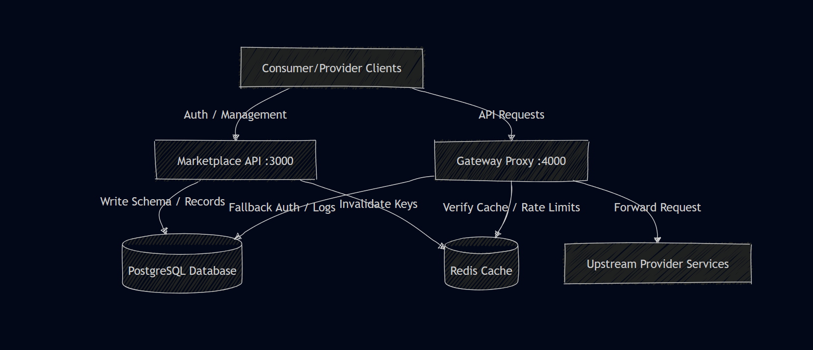

# ApexGateway Server Architecture & API Reference

Welcome to the backend architecture documentation for **ApexGateway**. The system is composed of two primary microservices that interact with a shared PostgreSQL database (managed via Prisma) and a high-performance Redis cache.

---

## 🏗️ Services Overview



### 1. Marketplace API (Port 3000)
Handles administrative, payment, and metadata operations:
- User registration and role synchronization (Provider vs. Consumer)
- API registration, publishing, and listing
- Plan creation and updates
- Subscription management and API Key distribution
- Financial ledger, Stripe payments, and provider balance withdrawals

### 2. Gateway Proxy (Port 4000)
A high-throughput proxy server validating and routing client requests:
- Intercepts incoming requests under `/api/:apiName/*`
- Inspects and hashes the `X-API-Key` header
- Performs O(1) authentication lookups against the Redis cache (falling back to database + caching on hit)
- Enforces token-bucket rate limits per subscription
- Logs latency and request metadata asynchronously to PostgreSQL and Redis analytics queue
- Strips authorization/gateway headers before rewriting and proxying to the API's `upstreamUrl`

---

## 🔑 Authentication Mechanisms

| Scope | Header | Format | Description |
| :--- | :--- | :--- | :--- |
| **Marketplace API** | `Authorization` | `Bearer <Supabase_JWT>` | Locally validated JWT issued by Supabase Auth containing user claims (`sub`, `email`, `user_metadata.role`). |
| **Gateway Proxy** | `X-API-Key` | `apx_live_<64_hex_chars>` | Secure client-facing credential generated upon subscription to a plan. Hashed via SHA-256 for database storage. |

---

## 📡 Marketplace API Endpoints (Port 3000)

### 🏥 System Health

#### Health Check
```http
GET /health
```
- **Auth**: None
- **Response**: `200 OK`
  ```json
  {
    "status": "ok",
    "service": "marketplace-api"
  }
  ```

---

### 👤 Authentication

#### User Registration & Sync
Synchronizes the Supabase user profile and role inside the local database.
```http
POST /auth/register
```
- **Auth**: Required (`Bearer <Supabase_JWT>`)
- **Headers**:
  - `Content-Type: application/json`
- **Request Body**:
  ```json
  {
    "role": "PROVIDER" 
  }
  ```
  *Note: Accepted roles are `"PROVIDER"` and `"CONSUMER"`.*
- **Response**: `200 OK`
  ```json
  {
    "message": "User synced successfully",
    "user": {
      "id": "e4293f3c-df89-4b68-b80c-2db8c0e6284f",
      "email": "user@example.com",
      "role": "PROVIDER"
    }
  }
  ```

#### Get Current User Profile
Retrieves currently logged-in user database profile.
```http
GET /auth/me
```
- **Auth**: Required (`Bearer <Supabase_JWT>`)
- **Response**: `200 OK`
  ```json
  {
    "user": {
      "id": "e4293f3c-df89-4b68-b80c-2db8c0e6284f",
      "email": "user@example.com",
      "role": "PROVIDER"
    }
  }
  ```

#### Login (Deprecated)
```http
POST /auth/login
```
- **Status**: `410 Gone`
- **Response**:
  ```json
  {
    "error": "Direct username/password login is deprecated. Please authenticate via Supabase."
  }
  ```

---

### 🔌 APIs Management

#### Create/Publish API
```http
POST /apis
```
- **Auth**: Required (`Bearer <Supabase_JWT>`, user role must be `PROVIDER` or `ADMIN`)
- **Headers**:
  - `Content-Type: application/json`
- **Request Body**:
  ```json
  {
    "name": "weather-service",
    "upstreamUrl": "https://api.open-meteo.com",
    "description": "Provides live weather updates",
    "allowedMethods": ["GET", "POST"],
    "exampleDocs": "https://open-meteo.com/en/docs"
  }
  ```
- **Response**: `201 Created`
  ```json
  {
    "message": "API published successfully",
    "api": {
      "id": "931c2ba4-d39b-442e-88cc-2dbb77fbcf24",
      "name": "weather-service",
      "description": "Provides live weather updates",
      "upstreamUrl": "https://api.open-meteo.com",
      "allowedMethods": ["GET", "POST"],
      "exampleDocs": "https://open-meteo.com/en/docs",
      "providerId": "e4293f3c-df89-4b68-b80c-2db8c0e6284f",
      "status": "ACTIVE",
      "createdAt": "2026-06-19T21:00:00.000Z"
    }
  }
  ```

#### List APIs
```http
GET /apis
```
- **Auth**: Optional (`Bearer <Supabase_JWT>`)
- **Description**: Returns all registered APIs. If authenticated as the provider of the API or an admin, the sensitive `upstreamUrl` field is returned. For other users, `upstreamUrl` is stripped.
- **Response**: `200 OK`
  ```json
  {
    "apis": [
      {
        "id": "931c2ba4-d39b-442e-88cc-2dbb77fbcf24",
        "name": "weather-service",
        "description": "Provides live weather updates",
        "exampleDocs": "https://open-meteo.com/en/docs",
        "providerId": "e4293f3c-df89-4b68-b80c-2db8c0e6284f",
        "status": "ACTIVE",
        "plans": [],
        "provider": {
          "id": "e4293f3c-df89-4b68-b80c-2db8c0e6284f",
          "email": "provider@example.com"
        }
      }
    ]
  }
  ```

#### Get API By ID
```http
GET /apis/:id
```
- **Auth**: Optional (`Bearer <Supabase_JWT>`)
- **Path Parameters**:
  - `id`: Unique UUID of the API.
- **Response**: `200 OK`
  ```json
  {
    "api": {
      "id": "931c2ba4-d39b-442e-88cc-2dbb77fbcf24",
      "name": "weather-service",
      "description": "Provides live weather updates",
      "providerId": "e4293f3c-df89-4b68-b80c-2db8c0e6284f",
      "status": "ACTIVE",
      "plans": [
        {
          "id": "81f1e31d-b586-4c7b-a2eb-5460a875a6c3",
          "name": "Basic Free",
          "requestsPerMin": 60,
          "price": 0
        }
      ],
      "provider": {
        "id": "e4293f3c-df89-4b68-b80c-2db8c0e6284f",
        "email": "provider@example.com"
      }
    }
  }
  ```

#### Get API Analytics Summary
```http
GET /apis/analytics/summary
```
- **Auth**: Required (`Bearer <Supabase_JWT>`, user role must be `PROVIDER` or `ADMIN`)
- **Description**: Returns aggregated usage logs for all APIs published by the calling provider over the last 24 hours.
- **Response**: `200 OK`
  ```json
  {
    "totalRequests": 1420,
    "avgLatency": 142.5,
    "rateLimitsHit": 12,
    "successRate": 98.4,
    "chartData": [
      {
        "time": "12:00 PM",
        "requests": 120,
        "latency": 135,
        "errors": 2
      }
    ]
  }
  ```

#### Get API Health Details
```http
GET /apis/:id/health
```
- **Auth**: Required (`Bearer <Supabase_JWT>`, caller must own the API or be an `ADMIN`)
- **Path Parameters**:
  - `id`: Unique UUID of the API.
- **Response**: `200 OK`
  ```json
  {
    "status": "OPERATIONAL",
    "uptime": 99.85,
    "avgLatency": 150,
    "latencyHistory": [
      {
        "timestamp": "12:00",
        "latency": 148
      }
    ]
  }
  ```
  *Note: Health status can be `"OPERATIONAL"`, `"DEGRADED"`, `"DOWN"`, or `"INACTIVE"`.*

---

### 💳 Plans Management

#### Create Plan
```http
POST /apis/:apiId/plans
```
- **Auth**: Required (`Bearer <Supabase_JWT>`, caller must own the target API or be an `ADMIN`)
- **Headers**:
  - `Content-Type: application/json`
- **Path Parameters**:
  - `apiId`: Unique UUID of the API.
- **Request Body**:
  ```json
  {
    "name": "Basic Free",
    "requestsPerMin": 60,
    "price": 0.0
  }
  ```
- **Response**: `201 Created`
  ```json
  {
    "message": "Plan created successfully",
    "plan": {
      "id": "81f1e31d-b586-4c7b-a2eb-5460a875a6c3",
      "apiId": "931c2ba4-d39b-442e-88cc-2dbb77fbcf24",
      "name": "Basic Free",
      "requestsPerMin": 60,
      "price": 0,
      "createdAt": "2026-06-19T21:02:00.000Z"
    }
  }
  ```

#### Update Plan
```http
PUT /apis/:apiId/plans/:planId
```
- **Auth**: Required (`Bearer <Supabase_JWT>`, caller must own the API or be an `ADMIN`)
- **Headers**:
  - `Content-Type: application/json`
- **Path Parameters**:
  - `apiId`: Unique UUID of the API.
  - `planId`: Unique UUID of the Plan.
- **Request Body**:
  ```json
  {
    "name": "Pro Tier",
    "requestsPerMin": 1000,
    "price": 29.99
  }
  ```
- **Response**: `200 OK`
  ```json
  {
    "message": "Plan updated successfully",
    "plan": {
      "id": "81f1e31d-b586-4c7b-a2eb-5460a875a6c3",
      "apiId": "931c2ba4-d39b-442e-88cc-2dbb77fbcf24",
      "name": "Pro Tier",
      "requestsPerMin": 1000,
      "price": 29.99,
      "updatedAt": "2026-06-19T21:05:00.000Z"
    }
  }
  ```

---

### 📝 Subscription Management

#### Subscribe to Plan
```http
POST /subscriptions
```
- **Auth**: Required (`Bearer <Supabase_JWT>`)
- **Headers**:
  - `Content-Type: application/json`
- **Request Body**:
  ```json
  {
    "planId": "81f1e31d-b586-4c7b-a2eb-5460a875a6c3"
  }
  ```
- **Response (Free Tier - Active Immediately)**: `201 Created`
  ```json
  {
    "message": "Subscribed to free tier successfully",
    "subscriptionId": "f7823ab1-5231-4cbb-9ab6-2b4a3900918c",
    "apiKey": "apx_live_a1b2c3d4...",
    "isActive": true
  }
  ```
- **Response (Paid Tier - Pending Payment)**: `201 Created`
  ```json
  {
    "message": "Checkout session created",
    "subscriptionId": "f7823ab1-5231-4cbb-9ab6-2b4a3900918c",
    "apiKey": "apx_live_a1b2c3d4...",
    "stripeCheckoutUrl": "https://checkout.stripe.com/pay/cs_test_...",
    "isActive": false
  }
  ```
  > [!IMPORTANT]
  > For paid tiers, the subscription and its API Key remain **inactive** until the Stripe checkout is complete. Make sure to present the `stripeCheckoutUrl` to the user so they can complete payment in a new tab.

#### Get Subscriptions
```http
GET /subscriptions
```
- **Auth**: Required (`Bearer <Supabase_JWT>`)
- **Description**: Returns subscriptions. Providers see subscriptions to their owned APIs. Consumers see their own subscriptions. For security, `apiKeyHash` is never returned in list payloads.
- **Response**: `200 OK`
  ```json
  {
    "subscriptions": [
      {
        "id": "f7823ab1-5231-4cbb-9ab6-2b4a3900918c",
        "consumerId": "48bcf24-d39b-442e-88cc-2dbb77fbcf93",
        "planId": "81f1e31d-b586-4c7b-a2eb-5460a875a6c3",
        "isActive": true,
        "createdAt": "2026-06-19T21:05:00.000Z",
        "plan": {
          "id": "81f1e31d-b586-4c7b-a2eb-5460a875a6c3",
          "name": "Basic Free",
          "price": 0,
          "api": {
            "id": "931c2ba4-d39b-442e-88cc-2dbb77fbcf24",
            "name": "weather-service"
          }
        }
      }
    ]
  }
  ```

#### Regenerate API Key
Invalidates the existing API Key in both cache and database, replacing it with a new one.
```http
POST /subscriptions/:id/regenerate
```
- **Auth**: Required (`Bearer <Supabase_JWT>`, caller must own the subscription)
- **Path Parameters**:
  - `id`: Unique UUID of the Subscription.
- **Response**: `200 OK`
  ```json
  {
    "message": "API key regenerated successfully",
    "apiKey": "apx_live_5d6e7f8g..."
  }
  ```

#### Cancel Subscription
Cancels a subscription. Invalidates the API Key cache in Redis and deletes the record from the database.
```http
DELETE /subscriptions/:id
```
- **Auth**: Required (`Bearer <Supabase_JWT>`, caller must own the subscription)
- **Path Parameters**:
  - `id`: Unique UUID of the Subscription.
- **Response**: `200 OK`
  ```json
  {
    "message": "Subscription cancelled successfully"
  }
  ```

---

### 💳 Financials & Payouts

#### Get Provider Earnings
```http
GET /payments/earnings
```
- **Auth**: Required (`Bearer <Supabase_JWT>`, user role must be `PROVIDER` or `ADMIN`)
- **Response**: `200 OK`
  ```json
  {
    "grossEarnings": 500.00,
    "totalWithdrawn": 150.00,
    "balance": 350.00,
    "transactions": [
      {
        "id": "tx_1a2b3c4d",
        "amount": 29.99,
        "createdAt": "2026-06-19T20:00:00.000Z",
        "subscription": {
          "plan": {
            "api": { "name": "weather-service" }
          }
        }
      }
    ],
    "withdrawals": [
      {
        "id": "wd_5e6f7g8h",
        "amount": 150.00,
        "payoutMethod": "paypal",
        "status": "COMPLETED",
        "createdAt": "2026-06-18T10:00:00.000Z"
      }
    ]
  }
  ```

#### Request Withdrawal
Submits a payout request. The requested amount is immediately deducted from the user's available balance and moved into a `PENDING` state.
```http
POST /payments/withdraw
```
- **Auth**: Required (`Bearer <Supabase_JWT>`, user role must be `PROVIDER` or `ADMIN`)
- **Headers**:
  - `Content-Type: application/json`
- **Request Body**:
  ```json
  {
    "amount": 100.00,
    "payoutMethod": "paypal",
    "payoutDetails": {
      "email": "provider-payment@example.com"
    }
  }
  ```
- **Response**: `201 Created`
  ```json
  {
    "message": "Withdrawal request submitted successfully.",
    "withdrawal": {
      "id": "wd_9i10j11k",
      "providerId": "e4293f3c-df89-4b68-b80c-2db8c0e6284f",
      "amount": 100,
      "payoutMethod": "paypal",
      "payoutDetails": { "email": "provider-payment@example.com" },
      "status": "PENDING",
      "createdAt": "2026-06-19T21:07:00.000Z"
    }
  }
  ```

#### Stripe Webhook
Receives Stripe webhook notifications asynchronously to process payments.
```http
POST /payments/webhook
```
- **Auth**: Handled by validating the `Stripe-Signature` header against the local webhook secret.
- **Headers**:
  - `Stripe-Signature`: Required header containing the webhook cryptographic hash.
- **Body**: Raw binary/string event details from Stripe.
- **Response**: `200 OK`
  ```json
  {
    "received": true
  }
  ```

---

## 🚀 Gateway Proxy Requests (Port 4000)

Clients interact with this gateway to hit the actual upstream services.

### Health Check
```http
GET /health
```
- **Auth**: None
- **Response**: `200 OK`
  ```json
  {
    "status": "ok",
    "service": "gateway-proxy"
  }
  ```

### Invoke API Upstream (Proxy Routing)
Routes HTTP requests to the target service.
```http
GET /api/:apiName/*
POST /api/:apiName/*
PUT /api/:apiName/*
DELETE /api/:apiName/*
```
- **Auth**: Required API Key in headers
- **Headers**:
  - `X-API-Key: apx_live_a1b2c3d4...`
- **Path Parameters**:
  - `apiName`: Slug name of the registered API.
- **Rules & Rate Limits**:
  - Requests are matched by the hashed API Key and checked if the subscription is active.
  - Path prefix `/api/:apiName` is stripped before proxying to the upstream URL. (E.g., `GET http://localhost:4000/api/weather-service/v1/forecast?lat=12` is rewritten to `GET https://api.open-meteo.com/v1/forecast?lat=12`).
  - Rate limiting is handled via a **Token Bucket** algorithm configured for the subscription's plan.
  - Gateway returns rate-limiting metrics headers with every response:
    - `X-RateLimit-Limit`: Maximum requests per minute allowed by the subscription plan.
    - `X-RateLimit-Remaining`: Tokens remaining in the bucket for the current minute window.
  - If rate limits are exceeded, returns **`429 Too Many Requests`** with a `Retry-After` header indicating waiting time in seconds.
- **Error Codes**:
  - `401 Unauthorized`: API key is missing or invalid.
  - `403 Forbidden`: Subscription is inactive, or the requested HTTP method is disallowed for this API.
  - `429 Too Many Requests`: Rate limit has been exceeded.
  - `502 Bad Gateway`: Upstream service failed to respond or is unreachable.
  - `503 Service Unavailable`: The API has been flagged as `INACTIVE` by its provider.

---

## 🛠️ How to Invoke (cURL Examples)

### 1. Register User / Sync Role (Marketplace)
```bash
curl -X POST http://localhost:3000/auth/register \
  -H "Authorization: Bearer YOUR_SUPABASE_JWT" \
  -H "Content-Type: application/json" \
  -d '{"role": "PROVIDER"}'
```

### 2. Register a New API (Marketplace)
```bash
curl -X POST http://localhost:3000/apis \
  -H "Authorization: Bearer YOUR_SUPABASE_JWT" \
  -H "Content-Type: application/json" \
  -d '{
    "name": "weather-service",
    "upstreamUrl": "https://api.open-meteo.com",
    "description": "Live weather reports",
    "allowedMethods": ["GET"]
  }'
```

### 3. Create a Plan (Marketplace)
```bash
curl -X POST http://localhost:3000/apis/931c2ba4-d39b-442e-88cc-2dbb77fbcf24/plans \
  -H "Authorization: Bearer YOUR_SUPABASE_JWT" \
  -H "Content-Type: application/json" \
  -d '{
    "name": "Basic Free",
    "requestsPerMin": 60,
    "price": 0.0
  }'
```

### 4. Subscribe & Get API Key (Marketplace)
```bash
curl -X POST http://localhost:3000/subscriptions \
  -H "Authorization: Bearer YOUR_SUPABASE_JWT" \
  -H "Content-Type: application/json" \
  -d '{"planId": "81f1e31d-b586-4c7b-a2eb-5460a875a6c3"}'
```

### 5. Call Upstream API (Gateway Proxy)
```bash
curl -X GET http://localhost:4000/api/weather-service/v1/forecast?latitude=52.52&longitude=13.41&current_weather=true \
  -H "X-API-Key: apx_live_YOUR_GENERATED_API_KEY"
```

---

## 📮 Postman Collection
An updated Postman collection is available at the root of the project as [ApexGateway.postman_collection.json](../ApexGateway.postman_collection.json).

Import this collection directly into Postman to test all endpoints. It comes pre-configured with environment variables:
- `{{marketplace_url}}` (default: `http://localhost:3000`)
- `{{gateway_url}}` (default: `http://localhost:4000`)
- `{{token}}` (Paste your active Supabase JWT here for bearer endpoints)
- `{{api_key}}` (Populates automatically on subscription, or paste manually to test proxy requests)
